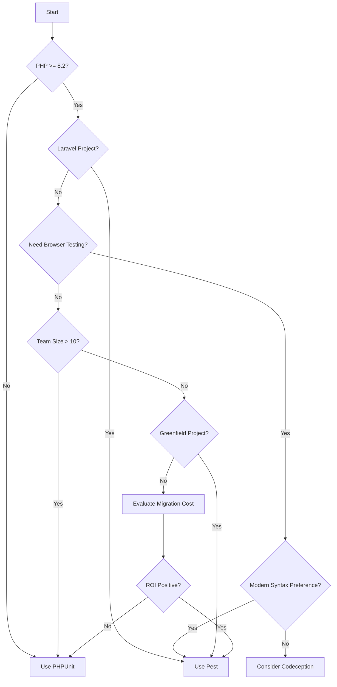

# Decision Matrix for Pest Testing Framework

## Framework Comparison Matrix

### Pest vs Other Testing Frameworks

| Feature | Pest 4 | PHPUnit 11 | Codeception | Behat | Kahlan |
|---------|--------|------------|-------------|--------|---------|
| **Syntax Style** | Functional | OOP | Mixed | Gherkin | BDD |
| **Learning Curve** | Low | Medium | High | Medium | Low |
| **Setup Complexity** | Minimal | Moderate | Complex | Moderate | Minimal |
| **Laravel Integration** | Excellent | Good | Good | Limited | Limited |
| **Browser Testing** | Native | Via Plugins | Native | Via Plugins | No |
| **Architecture Testing** | Native | No | No | No | No |
| **Parallel Testing** | Native | Native | Native | Limited | No |
| **Mutation Testing** | Native | Via Plugins | No | No | No |
| **Coverage Analysis** | Native | Native | Native | Limited | Native |
| **IDE Support** | Good | Excellent | Good | Good | Limited |
| **Community Size** | Growing | Large | Medium | Medium | Small |
| **Documentation** | Excellent | Excellent | Good | Good | Fair |
| **Performance** | Fast | Fast | Moderate | Slow | Fast |
| **Memory Usage** | Low | Low | High | Moderate | Low |

## Use Case Recommendations

### When to Use Pest

```php
// Ideal for these scenarios
$idealForPest = [
    'laravel_applications' => 'First-class Laravel support',
    'modern_php_projects' => 'PHP 8.2+ with modern syntax',
    'rapid_development' => 'Quick test writing with minimal boilerplate',
    'small_to_medium_teams' => 'Easy onboarding and readable tests',
    'greenfield_projects' => 'Starting fresh with modern tools',
    'architecture_validation' => 'Built-in architecture testing',
    'browser_testing_needs' => 'Integrated Playwright support',
];

// Example: Laravel API with architecture rules
test('perfect Pest use case', function () {
    // Laravel API testing
    $response = $this->postJson('/api/users', [...]);
    expect($response->status())->toBe(201);
    
    // Architecture validation
    arch('controllers')->expect('App\Http\Controllers')
        ->toUseNothing()
        ->except(['App\Services', 'App\Models']);
});
```

### When NOT to Use Pest

```php
// Consider alternatives for
$notIdealForPest = [
    'legacy_php_versions' => 'Requires PHP 8.2+',
    'enterprise_with_phpunit' => 'Large PHPUnit test suites',
    'bdd_gherkin_requirement' => 'Use Behat instead',
    'non_php_testing' => 'Language-specific tools better',
    'windows_primary_dev' => 'Better Unix/Mac support',
];
```

## Selection Criteria

### Technical Requirements

```php
// Evaluate based on technical needs
class TechnicalCriteria
{
    public function evaluate(): array
    {
        return [
            'php_version' => PHP_VERSION_ID >= 80200,
            'framework' => in_array('Laravel', $this->frameworks),
            'testing_types' => [
                'unit' => true,
                'integration' => true,
                'browser' => true,
                'api' => true,
            ],
            'ci_cd_support' => true,
            'coverage_required' => true,
            'parallel_execution' => true,
        ];
    }
}
```

### Team Considerations

```php
// Team readiness assessment
$teamReadiness = [
    'php_experience' => 'intermediate', // beginner|intermediate|advanced
    'testing_experience' => 'basic',     // none|basic|experienced
    'learning_budget' => 'available',    // none|limited|available
    'migration_capacity' => 'gradual',   // none|gradual|full
];

// Decision based on team
if ($teamReadiness['testing_experience'] === 'basic' && 
    $teamReadiness['learning_budget'] === 'available') {
    return 'Pest is ideal - minimal learning curve';
}
```

### Project Type Matrix

| Project Type | Pest Suitability | Reason |
|--------------|-----------------|---------|
| Laravel Web App | ⭐⭐⭐⭐⭐ | Native integration, all features |
| Laravel API | ⭐⭐⭐⭐⭐ | Excellent API testing support |
| Symfony App | ⭐⭐⭐⭐ | Good support, some setup needed |
| WordPress Plugin | ⭐⭐⭐ | Possible but not optimal |
| Microservice | ⭐⭐⭐⭐ | Fast, lightweight testing |
| CLI Tool | ⭐⭐⭐⭐ | Great for testing commands |
| Library/Package | ⭐⭐⭐⭐⭐ | Perfect for unit tests |
| Legacy Codebase | ⭐⭐ | PHP version constraints |

## Migration Cost Analysis

### From PHPUnit to Pest

```php
// Migration effort calculator
class MigrationCostCalculator
{
    public function estimate(array $project): array
    {
        $testCount = $project['test_count'];
        $complexity = $project['complexity']; // low|medium|high
        
        // Time estimates (hours)
        $estimates = [
            'setup' => 2,
            'training' => 16,
            'migration_per_test' => match($complexity) {
                'low' => 0.1,
                'medium' => 0.3,
                'high' => 0.5,
            },
            'testing_and_validation' => $testCount * 0.05,
        ];
        
        $totalHours = array_sum($estimates) + ($testCount * $estimates['migration_per_test']);
        
        return [
            'total_hours' => $totalHours,
            'total_days' => $totalHours / 8,
            'can_be_gradual' => true,
            'risk_level' => 'low',
        ];
    }
}

// Example: 500 PHPUnit tests, medium complexity
$migration = new MigrationCostCalculator();
$cost = $migration->estimate([
    'test_count' => 500,
    'complexity' => 'medium'
]);
// Result: ~193 hours (24 days), can be done gradually
```

### Cost-Benefit Analysis

```php
// ROI calculation for Pest adoption
$benefits = [
    'reduced_test_writing_time' => 0.30, // 30% faster
    'improved_readability' => 0.25,      // 25% fewer bugs
    'better_coverage' => 0.20,           // 20% more coverage
    'team_satisfaction' => 0.15,         // 15% retention improvement
];

$costs = [
    'migration_effort' => 24, // days
    'training_time' => 2,     // days per developer
    'tool_adoption' => 1,     // days
];

$yearlyTestingDays = 50; // days spent on testing per year
$yearlyBenefit = $yearlyTestingDays * array_sum($benefits);
$breakEvenPoint = array_sum($costs) / $yearlyBenefit;
// Result: Break-even in ~0.6 years
```

## When to Use/Not Use

### Use Pest When ✅

```php
$usePest = [
    // Project characteristics
    'new_project' => true,
    'php_8_2_or_higher' => true,
    'laravel_framework' => true,
    'modern_development_practices' => true,
    
    // Team characteristics
    'open_to_new_tools' => true,
    'values_developer_experience' => true,
    'wants_readable_tests' => true,
    
    // Technical requirements
    'needs_browser_testing' => true,
    'wants_architecture_validation' => true,
    'requires_fast_feedback' => true,
    'values_minimal_boilerplate' => true,
];
```

### Don't Use Pest When ❌

```php
$dontUsePest = [
    // Project constraints
    'legacy_php_version' => 'PHP < 8.2',
    'massive_phpunit_suite' => 'Thousands of existing tests',
    'enterprise_standardization' => 'Company mandates PHPUnit',
    'windows_only_development' => 'Better alternatives exist',
    
    // Team constraints
    'no_learning_budget' => 'Cannot invest in training',
    'resistant_to_change' => 'Team prefers status quo',
    'extensive_phpunit_expertise' => 'Deep investment in PHPUnit',
    
    // Technical constraints
    'complex_test_inheritance' => 'Heavy use of test class hierarchy',
    'custom_phpunit_extensions' => 'Depends on PHPUnit internals',
    'non_standard_testing_needs' => 'Requires specific tools',
];
```

## Decision Framework

### Quick Decision Tree



### Scoring System

```php
class PestSuitabilityScore
{
    private int $score = 0;
    
    public function calculate(array $project): int
    {
        // Technical factors (40 points max)
        if ($project['php_version'] >= 8.2) $this->score += 10;
        if ($project['framework'] === 'Laravel') $this->score += 15;
        if ($project['needs_browser_testing']) $this->score += 10;
        if ($project['needs_architecture_testing']) $this->score += 5;
        
        // Team factors (30 points max)
        if ($project['team_size'] <= 10) $this->score += 10;
        if ($project['testing_experience'] === 'beginner') $this->score += 10;
        if ($project['open_to_change']) $this->score += 10;
        
        // Project factors (30 points max)
        if ($project['greenfield']) $this->score += 15;
        if ($project['test_count'] < 500) $this->score += 10;
        if ($project['development_speed_priority']) $this->score += 5;
        
        return $this->score; // 70+ = Strongly Recommended
    }
}
```

## Implementation Strategy

### Pilot Project Approach

```php
// Start with a pilot project
$pilotStrategy = [
    'week_1' => 'Set up Pest in a small project',
    'week_2' => 'Write 10-20 tests',
    'week_3' => 'Try advanced features (datasets, architecture)',
    'week_4' => 'Team review and decision',
];

// Success metrics
$successMetrics = [
    'test_writing_speed' => 'Time to write 10 tests',
    'test_readability' => 'Team survey score',
    'coverage_achieved' => 'Coverage percentage',
    'bugs_caught' => 'Issues found by tests',
    'team_satisfaction' => 'Developer feedback',
];
```

### Gradual Adoption Path

```php
// Phase-based adoption
$adoptionPhases = [
    'phase_1' => [
        'duration' => '2 weeks',
        'goal' => 'New tests in Pest',
        'keep' => 'Existing PHPUnit tests',
    ],
    'phase_2' => [
        'duration' => '1 month',
        'goal' => 'Migrate simple tests',
        'focus' => 'Unit tests',
    ],
    'phase_3' => [
        'duration' => '2 months',
        'goal' => 'Migrate integration tests',
        'add' => 'Architecture tests',
    ],
    'phase_4' => [
        'duration' => '1 month',
        'goal' => 'Add browser tests',
        'complete' => 'Full migration',
    ],
];
```

## Final Recommendation Matrix

| Your Situation | Recommendation | Confidence |
|----------------|----------------|------------|
| New Laravel project | **Use Pest** | 95% |
| Existing Laravel with < 500 tests | **Migrate to Pest** | 85% |
| Existing Laravel with > 500 tests | **Gradual adoption** | 70% |
| Non-Laravel PHP 8.2+ project | **Consider Pest** | 75% |
| Legacy PHP project | **Keep PHPUnit** | 90% |
| Enterprise with PHPUnit standard | **Keep PHPUnit** | 85% |
| BDD requirement | **Use Behat + Pest** | 80% |
| Learning testing | **Start with Pest** | 90% |

## Conclusion

```php
// Final decision helper
function shouldUsePest(array $project): string
{
    $score = (new PestSuitabilityScore())->calculate($project);
    
    return match(true) {
        $score >= 70 => 'Strongly Recommended',
        $score >= 50 => 'Recommended',
        $score >= 30 => 'Consider It',
        default => 'Not Recommended',
    };
}
```