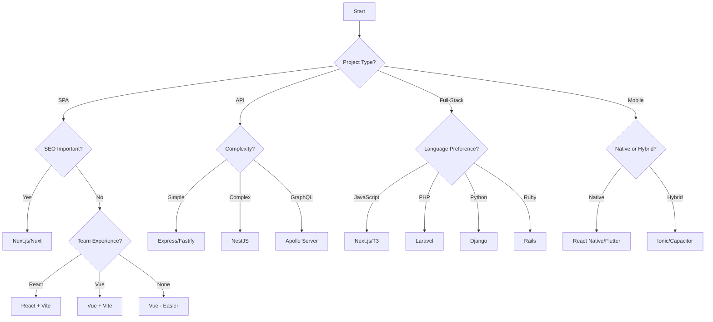

# Framework Decision Matrix

## Framework Selection Criteria

### Project Requirements Assessment
```markdown
## Key Questions to Answer

### Project Type
- [ ] Single Page Application (SPA)?
- [ ] Server-Side Rendered (SSR)?
- [ ] Static Site Generation (SSG)?
- [ ] Progressive Web App (PWA)?
- [ ] Mobile App (React Native/Ionic)?
- [ ] Desktop App (Electron)?
- [ ] API/Backend Service?
- [ ] Full-Stack Application?

### Performance Requirements
- [ ] Initial load time critical?
- [ ] SEO important?
- [ ] Real-time updates needed?
- [ ] Offline functionality required?
- [ ] Heavy data processing?
- [ ] High concurrent users?

### Team Considerations
- [ ] Team size?
- [ ] Experience level?
- [ ] Existing expertise?
- [ ] Learning curve acceptable?
- [ ] Long-term maintenance team?

### Business Constraints
- [ ] Timeline pressure?
- [ ] Budget limitations?
- [ ] Scaling requirements?
- [ ] Enterprise requirements?
- [ ] Compliance needs?
```

## Frontend Framework Comparison

### Major Framework Matrix
```markdown
| Criteria | React | Vue | Angular | Svelte | Solid |
|----------|-------|-----|---------|--------|-------|
| **Learning Curve** | Medium | Low | High | Low | Medium |
| **Performance** | Good* | Good | Good | Excellent | Excellent |
| **Bundle Size** | Medium | Small | Large | Tiny | Tiny |
| **Ecosystem** | Huge | Large | Large | Growing | Small |
| **TypeScript** | Good | Good | Excellent | Good | Good |
| **Community** | Huge | Large | Large | Growing | Small |
| **Job Market** | Excellent | Good | Good | Emerging | Rare |
| **Enterprise** | Yes | Yes | Yes | Maybe | No |
| **Mobile** | React Native | NativeScript/Ionic | Ionic/NativeScript | Native | No |
| **SSR/SSG** | Next.js | Nuxt | Universal | SvelteKit | SolidStart |

*With optimization
```

### Use Case Recommendations
```javascript
const frameworkSelector = {
  // Large Enterprise Application
  enterprise: {
    primary: 'Angular',
    alternative: 'React',
    reasons: [
      'Opinionated structure',
      'Built-in everything',
      'TypeScript first',
      'Enterprise support'
    ]
  },
  
  // Startup/MVP
  startup: {
    primary: 'Next.js (React)',
    alternative: 'Nuxt (Vue)',
    reasons: [
      'Fast development',
      'Full-stack capability',
      'Easy deployment',
      'Good ecosystem'
    ]
  },
  
  // Marketing/Content Site
  marketing: {
    primary: 'Astro',
    alternative: 'Next.js',
    reasons: [
      'Excellent performance',
      'SEO optimized',
      'Static generation',
      'Multi-framework support'
    ]
  },
  
  // Dashboard/Admin Panel
  dashboard: {
    primary: 'React + Material-UI',
    alternative: 'Vue + Element Plus',
    reasons: [
      'Rich component libraries',
      'Data visualization tools',
      'Complex state management',
      'Enterprise features'
    ]
  },
  
  // E-commerce
  ecommerce: {
    primary: 'Next.js',
    alternative: 'Nuxt',
    reasons: [
      'SSR for SEO',
      'Performance critical',
      'Dynamic content',
      'Payment integrations'
    ]
  },
  
  // Real-time Application
  realtime: {
    primary: 'React + Socket.io',
    alternative: 'Vue + WebSockets',
    reasons: [
      'Efficient re-rendering',
      'State management',
      'WebSocket support',
      'Component updates'
    ]
  }
};
```

## Backend Framework Comparison

### Backend Framework Matrix
```markdown
| Criteria | Express | NestJS | Fastify | Koa | Hapi | Django | Laravel | Rails |
|----------|---------|--------|---------|-----|------|--------|---------|-------|
| **Language** | Node.js | Node.js | Node.js | Node.js | Node.js | Python | PHP | Ruby |
| **Learning Curve** | Low | High | Medium | Low | Medium | Medium | Medium | Medium |
| **Performance** | Good | Good | Excellent | Good | Good | Good | Good | Moderate |
| **Type Safety** | Optional | Built-in | Optional | Optional | Optional | Optional | Optional | No |
| **Architecture** | Minimal | Opinionated | Minimal | Minimal | Plugin | MTV | MVC | MVC |
| **ORM** | Various | TypeORM | Various | Various | Various | Built-in | Eloquent | ActiveRecord |
| **Ecosystem** | Huge | Growing | Medium | Medium | Small | Large | Large | Large |
| **Enterprise** | Yes | Yes | Yes | Maybe | Yes | Yes | Yes | Yes |
| **Microservices** | Good | Excellent | Excellent | Good | Good | Moderate | Moderate | Moderate |
| **Documentation** | Good | Excellent | Good | Good | Good | Excellent | Excellent | Excellent |
```

### Backend Use Cases
```javascript
const backendSelector = {
  // Microservices
  microservices: {
    primary: 'NestJS',
    alternative: 'Fastify',
    reasons: [
      'Modular architecture',
      'TypeScript support',
      'Dependency injection',
      'Microservice ready'
    ]
  },
  
  // REST API
  restAPI: {
    primary: 'Express',
    alternative: 'Fastify',
    reasons: [
      'Simple and flexible',
      'Huge ecosystem',
      'Well documented',
      'Battle tested'
    ]
  },
  
  // GraphQL API
  graphql: {
    primary: 'Apollo Server',
    alternative: 'NestJS + GraphQL',
    reasons: [
      'GraphQL first',
      'Type generation',
      'Subscriptions',
      'Federation support'
    ]
  },
  
  // Full-Stack Framework
  fullstack: {
    primary: 'Laravel',
    alternative: 'Django',
    reasons: [
      'Batteries included',
      'ORM built-in',
      'Admin panel',
      'Authentication'
    ]
  },
  
  // Real-time/WebSocket
  websocket: {
    primary: 'Socket.io + Express',
    alternative: 'Fastify + ws',
    reasons: [
      'WebSocket support',
      'Room management',
      'Fallback options',
      'Client libraries'
    ]
  }
};
```

## Database Selection Matrix

### Database Comparison
```markdown
| Criteria | PostgreSQL | MySQL | MongoDB | Redis | SQLite | DynamoDB | Firestore |
|----------|------------|-------|---------|-------|--------|----------|-----------|
| **Type** | Relational | Relational | Document | Key-Value | Relational | NoSQL | Document |
| **ACID** | Yes | Yes | Yes* | No | Yes | Yes** | Yes** |
| **Scalability** | Vertical+ | Vertical+ | Horizontal | Horizontal | Single | Horizontal | Horizontal |
| **Performance** | Excellent | Excellent | Excellent | Blazing | Good | Excellent | Good |
| **Complex Queries** | Excellent | Good | Limited | No | Good | Limited | Limited |
| **Full-Text Search** | Yes | Yes | Yes | No | Limited | No | Limited |
| **Cost** | Free/Managed | Free/Managed | Free/Managed | Free/Managed | Free | Pay-per-use | Pay-per-use |
| **Use Case** | General | General | Flexible | Cache | Embedded | Serverless | Mobile/Web |

*With transactions
**Eventually consistent options available
```

## CSS Framework Comparison

### CSS Framework Matrix
```markdown
| Framework | Tailwind | Bootstrap | Material-UI | Ant Design | Chakra UI | Bulma |
|-----------|----------|-----------|-------------|------------|-----------|-------|
| **Approach** | Utility | Component | Component | Component | Component | CSS only |
| **Customization** | Excellent | Good | Good | Moderate | Excellent | Good |
| **Bundle Size** | Small* | Large | Large | Large | Medium | Medium |
| **Learning Curve** | Medium | Low | Medium | Low | Low | Low |
| **React Support** | Any | Yes | Native | Native | Native | Any |
| **Vue Support** | Any | Yes | Port | Port | No | Any |
| **Design System** | DIY | Yes | Material | Ant | Custom | Custom |
| **Dark Mode** | Built-in | Manual | Built-in | Built-in | Built-in | Manual |
| **TypeScript** | N/A | Yes | Yes | Yes | Yes | N/A |

*With PurgeCSS
```

## State Management Comparison

### State Management Solutions
```markdown
| Solution | Redux | Zustand | MobX | Recoil | Jotai | Pinia | Context API |
|----------|-------|---------|------|--------|-------|-------|-------------|
| **Complexity** | High | Low | Medium | Medium | Low | Low | Low |
| **Bundle Size** | Large | Tiny | Medium | Medium | Small | Small | None |
| **DevTools** | Excellent | Good | Good | Good | Basic | Good | Basic |
| **TypeScript** | Good | Excellent | Good | Good | Excellent | Excellent | Native |
| **Learning Curve** | Steep | Gentle | Medium | Medium | Gentle | Gentle | Gentle |
| **Boilerplate** | Heavy | Minimal | Moderate | Moderate | Minimal | Minimal | Minimal |
| **Time Travel** | Yes | Yes* | Yes | Yes | No | Yes | No |
| **Framework** | Any | React | Any | React | React | Vue | React |

*With middleware
```

## Build Tool Comparison

### Build Tool Matrix
```markdown
| Tool | Webpack | Vite | Parcel | ESBuild | Rollup | Turbopack |
|------|---------|------|--------|---------|--------|-----------|
| **Speed** | Slow | Fast | Fast | Blazing | Medium | Blazing |
| **Config** | Complex | Simple | Zero | Simple | Medium | Simple |
| **HMR** | Yes | Excellent | Yes | Basic | Plugin | Excellent |
| **Bundle Size** | Good | Good | Good | Excellent | Excellent | Good |
| **Ecosystem** | Huge | Growing | Medium | Small | Large | New |
| **CSS** | Yes | Yes | Yes | Plugin | Plugin | Yes |
| **TypeScript** | Plugin | Native | Native | Native | Plugin | Native |
| **Production** | Excellent | Good | Good | Good | Excellent | Beta |
```

## Testing Framework Comparison

### Testing Tool Matrix
```markdown
| Tool | Jest | Vitest | Mocha | Cypress | Playwright | Testing Library |
|------|------|--------|-------|---------|------------|-----------------|
| **Type** | Unit | Unit | Unit | E2E | E2E | Integration |
| **Speed** | Good | Excellent | Good | Slow | Fast | Good |
| **Config** | Medium | Simple | Simple | Simple | Simple | Simple |
| **Coverage** | Built-in | Built-in | Plugin | No | No | N/A |
| **Snapshot** | Yes | Yes | No | Screenshots | Screenshots | No |
| **Watch Mode** | Yes | Yes | Plugin | Yes | Yes | N/A |
| **Parallel** | Yes | Yes | No | Yes | Yes | N/A |
| **Browser** | JSDOM | JSDOM/Real | Real | Real | Real | JSDOM/Real |
```

## Deployment Platform Comparison

### Hosting Platform Matrix
```markdown
| Platform | Vercel | Netlify | AWS | Heroku | Railway | Fly.io | Render |
|----------|--------|---------|-----|--------|---------|--------|--------|
| **Type** | Serverless | Serverless | IaaS | PaaS | PaaS | PaaS | PaaS |
| **Pricing** | Free tier | Free tier | Pay-use | Free tier | Pay-use | Free tier | Free tier |
| **Scaling** | Auto | Auto | Manual/Auto | Auto | Auto | Auto | Auto |
| **Databases** | Partner | Partner | Full | Add-ons | Built-in | Built-in | Built-in |
| **CI/CD** | Built-in | Built-in | Complex | Built-in | Built-in | Built-in | Built-in |
| **SSL** | Auto | Auto | Manual | Auto | Auto | Auto | Auto |
| **Domains** | Yes | Yes | Yes | Yes | Yes | Yes | Yes |
| **Functions** | Yes | Yes | Lambda | No | No | No | Yes |
| **Ease** | Easiest | Easy | Complex | Easy | Easy | Medium | Easy |
```

## Decision Flow Chart

### Framework Selection Process


## Migration Cost Analysis

### Migration Effort Matrix
```markdown
| From → To | React → Vue | Vue → React | Angular → React | jQuery → Modern | Monolith → Micro |
|-----------|-------------|-------------|-----------------|-----------------|------------------|
| **Effort** | High | High | Very High | Very High | Extreme |
| **Time** | 3-6 months | 3-6 months | 6-12 months | 6-12 months | 12+ months |
| **Risk** | Medium | Medium | High | High | Very High |
| **Training** | Required | Required | Required | Required | Extensive |
| **Benefits** | Questionable | Questionable | Maybe | Yes | Depends |
| **Recommendation** | Avoid | Avoid | Case-by-case | Recommended | Plan carefully |
```

## Final Decision Checklist

### Before Committing
```markdown
## Final Evaluation

### Technical Fit
- [ ] Meets all technical requirements
- [ ] Performance acceptable
- [ ] Scalability path clear
- [ ] Security features adequate
- [ ] Integration possible

### Team Fit
- [ ] Team comfortable with choice
- [ ] Training resources available
- [ ] Hiring pool adequate
- [ ] Documentation quality good
- [ ] Community support active

### Business Fit
- [ ] Timeline achievable
- [ ] Budget sufficient
- [ ] Maintenance sustainable
- [ ] Vendor lock-in acceptable
- [ ] Future-proof enough

### Risk Assessment
- [ ] Fallback plan exists
- [ ] Critical dependencies stable
- [ ] Security vulnerabilities manageable
- [ ] Performance risks understood
- [ ] Scale limitations acceptable

### Go/No-Go
- [ ] Prototype successful
- [ ] Stakeholders aligned
- [ ] Team trained
- [ ] Infrastructure ready
- [ ] Support plan in place
```

## Framework Sunset Indicators

### When to Consider Migration
```markdown
## Warning Signs

### Critical (Migrate Soon)
- No security updates for 6+ months
- Major vulnerabilities unpatched
- Core team disbanded
- Community exodus
- No ecosystem support

### Serious (Plan Migration)
- Declining npm downloads
- Few Stack Overflow posts
- Job market drying up
- Better alternatives mature
- Performance issues unsolvable

### Monitor (Stay Alert)
- Slow feature development
- Community fragmentation
- Corporate backing withdrawn
- Competitive disadvantage
- Technical debt mounting
```
