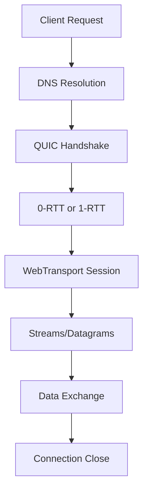

# WebTransport Protocol Overview

## What is WebTransport?

WebTransport is a modern web API that provides low-latency, bidirectional, client-server messaging over HTTP/3 (QUIC). It's designed to replace WebSockets for real-time applications, offering better performance, reliability, and security.

## Key Features

### 1. Protocol Foundation
- **Built on HTTP/3 (QUIC)**: Leverages the QUIC transport protocol
- **Multiplexing**: Multiple streams over a single connection
- **Low Latency**: Reduced connection establishment time (0-RTT)
- **Unreliable Transport**: Optional unreliable datagrams for gaming/streaming

### 2. Core Advantages Over WebSockets

| Feature | WebTransport | WebSockets |
|---------|--------------|------------|
| Protocol | HTTP/3 (QUIC) | TCP |
| Connection Setup | 0-RTT possible | 1-RTT minimum |
| Head-of-line Blocking | No | Yes |
| Multiplexing | Native | No |
| Unreliable Messaging | Yes (datagrams) | No |
| Backpressure | Built-in | Manual |
| Binary Support | Native | Base64 encoding needed |

### 3. Transport Modes

#### Bidirectional Streams
```javascript
// Client initiates bidirectional stream
const stream = await transport.createBidirectionalStream();
const writer = stream.writable.getWriter();
const reader = stream.readable.getReader();

// Send data
await writer.write(new Uint8Array([1, 2, 3]));

// Receive data
const { value, done } = await reader.read();
```

#### Unidirectional Streams
```javascript
// Server-to-client stream
const stream = await transport.createUnidirectionalStream();
const writer = stream.getWriter();
await writer.write(data);
```

#### Datagrams (Unreliable)
```javascript
// Send unreliable datagram
const writer = transport.datagrams.writable.getWriter();
await writer.write(new Uint8Array([1, 2, 3]));

// Receive datagrams
const reader = transport.datagrams.readable.getReader();
const { value } = await reader.read();
```

## Use Cases

### Real-time Applications
- **Gaming**: Low-latency multiplayer games
- **Live Streaming**: Video/audio streaming with minimal delay
- **Collaborative Editing**: Google Docs-style real-time collaboration
- **IoT**: Sensor data streaming
- **Financial Trading**: Real-time market data

### Why Choose WebTransport?

1. **Performance**: QUIC's 0-RTT connection establishment
2. **Reliability**: Automatic retransmission for streams
3. **Flexibility**: Mix reliable and unreliable data
4. **Security**: Built-in encryption via QUIC
5. **NAT Traversal**: Better than WebSockets
6. **Mobile Optimization**: Connection migration on network changes

## Browser Support (2025)

| Browser | Version | Support |
|---------|---------|---------|
| Chrome | 97+ | ✅ Full |
| Edge | 97+ | ✅ Full |
| Firefox | 114+ | ✅ Full |
| Safari | 17+ | ⚠️ Partial |
| Opera | 83+ | ✅ Full |

## Server Requirements

- **HTTP/3 Support**: Required (nginx 1.25+, Caddy 2.6+)
- **TLS 1.3**: Mandatory for QUIC
- **UDP Port 443**: Must be open
- **QUIC Implementation**: Required server-side

## Connection Lifecycle



## Security Considerations

1. **Origin Isolation**: Same-origin policy applies
2. **Certificate Requirements**: Valid TLS certificate required
3. **CORS**: Cross-origin requires proper headers
4. **CSP**: Content Security Policy support
5. **Encryption**: Always encrypted via QUIC

## Performance Metrics

### Latency Comparison
- **WebSocket Setup**: ~100-300ms
- **WebTransport Setup**: ~0-100ms (with 0-RTT)
- **Message Latency**: 20-50% lower than WebSockets

### Throughput
- **Streams**: Similar to WebSockets
- **Datagrams**: 2-3x faster for unreliable data
- **Multiplexing**: No head-of-line blocking

## Fallback Strategies

```javascript
async function connectWithFallback(url) {
  try {
    // Try WebTransport first
    const transport = new WebTransport(url);
    await transport.ready;
    return { type: 'webtransport', connection: transport };
  } catch (e) {
    // Fallback to WebSocket
    const ws = new WebSocket(url.replace('https://', 'wss://'));
    return { type: 'websocket', connection: ws };
  }
}
```

## Next Steps

- [Implementation with Laravel 12](./02-laravel-implementation.md)
- [Implementation with Nuxt 4](./03-nuxt-implementation.md)
- [Production Deployment](./04-production-deployment.md)
- [Performance Optimization](./05-performance-optimization.md)
